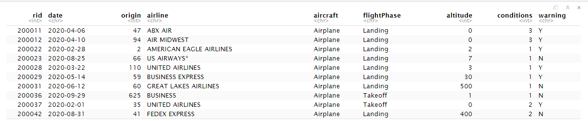
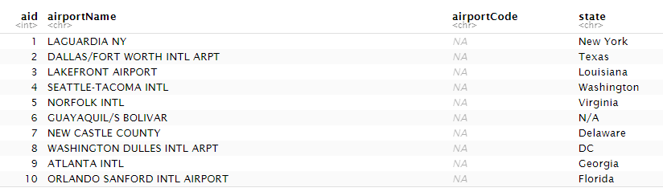
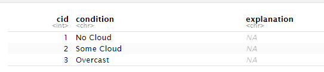
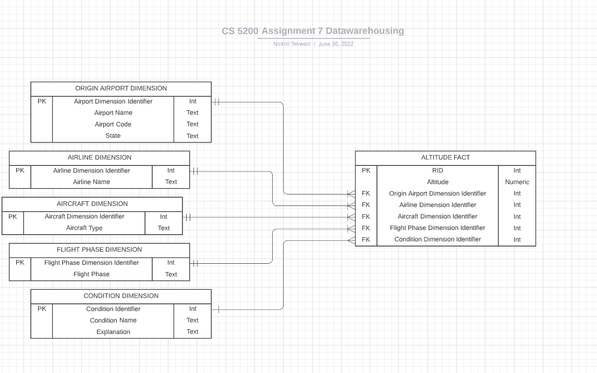

\newpage
# Question 1
## Data warehouses are often constructed using relational databases. Explain the use of fact tables and star schemas to construct a data warehouse in a relational database. Also comment on whether a transactional database can and should be used to OLAP.

Data warehouses are typically built using relational databases, and fact tables/star schemas are used in this process. Each star schema has a singular fact table at its core, and contains all of the quantitative primary data for analysis. It is also typically denormalized. These quantitative records act as independent variables for dimensional analysis in the context of the data domain of the data warehouse. Dimensional data is stored as a foreign key to a dimension table which additional information about the record for analysis. 
Star schemas are comprised of a combination of 1 fact table and 1 or more dimension tables. Star schemas contain data in a way that is optimized for querying large datasets. 
OLAP (online analytical processing) is a technique of analyzing data to find insights across multiple dimensions or database systems. Data warehousing and star schemas is one example of the OLAP system. Transactional databases should not be used for OLAP as they are optimized for recording and writing data, not analysis of data. 

\newpage
# Question 2
## Explain the difference between a data warehouse, a data mart, and a data lake. Provide at least one example of their use from your experience or how you believe they might be used in practice. Find at least one video, article, or tutorial online that explains the differences and embed that into your notebook.

Data warehouses are typically used for operational uses in which the user needs to generate reports or conduct some kind of analytics on the data. They typically only store cleaned data for easy modeling and reporting.
Data lakes, on the other hand, are all in one solutions to conduct deep analysis on the data. They typically contain ALL data (raw, unfiltered, and unstructured) of an organization, and utilize different hardware for cost-effective storage abilities. 
Data marts are essentially subsets of both of these. They store filtered, structured data that is essential only to one department or function instead of being all encompassing solutions. 
All 3 are utilized for OLAP.

One example of all 3 of these in use can be at a large tech company. Netflix is a subscription-based streaming service for consumers to access a multitude of content (primarily TV shows and movies), but they also produce their own feature films and TV shows which is featured exclusively on their streaming platform. 
A data lake at Netflix may contain all information across the entire business -- information on what content is offered on their platform, information on deals and exclusivity contracts with 3rd parties, information on its users (operationally and in terms of ad and recommendation optimization), revenue information (aggregate of both consumer subscription and through deals with production companies), and internal business or HR operational data. 
A data warehouse at Netflix would also contain information related to the entire company, but in a structured manner. For example, for the sake of ads and recommendation, the data lake may contain cookies and browsing data on all of its users in a large blob. Instead of containing all browsing history for all users, the data warehouse may contain information for each user simply summarizing their preferences, or time of day that they watch certain movies, etc. 
A data mart at Netflix would be a smaller solution just for an individual department. For example, HR may have a data mart just containing information about all of its employees, their salary, time at the company, office location, etc. 

_**[Click here for article from zuar.com titled "Data Mart vs Data Warehouse vs Database vs Data Lake"](https://www.zuar.com/blog/data-mart-vs-data-warehouse-vs-database-vs-data-lake/#:~:text=Data%20lakes%20are%20better%20for,stored%20in%20different%20user%20areas.)**_

\newpage
# Question 3
## After the general explanation of fact tables and star schemas, design an appropriate fact table for Practicum I's bird strike database. Of course, there are many fact tables one could build, so pick some analytics problem and design a fact table for that. Be sure to explain your approach and design reasons. Just design it (perhaps draw an ERD for it); you do not need to actually implement it or populate it with data (of course, you may do so if you wish in preparation for the next practicum).

The bird strike database from Practicum 1 contained information on bird strikes on aircrafts. Sample data from bird strike data:

\newpage
We can build a star schema for looking at analysis of bird strikes in the context of altitude at which they occurred. This may give us more insight into why a certain altitude range contains more bird strikes than others. 
Our fact table will have core information on an RID and the altitude at which the bird strike of that ID happened. Then, we will have foreign keys to our dimensional tables: the flight phase, origin airport, type of aircraft, conditions, and airline dimensions. This is designed in such a way that our target quantitative data (altitude) can be analyzed in the context of these 5 dimensions. These dimensions don't all necessarily have a direct correlation with our target altitude statistic, but this star schema is designed in such a way that both causations and correlations can be identified and analyzed. 

See sample star schema for altitude analysis (with 5 dimensions) below:

